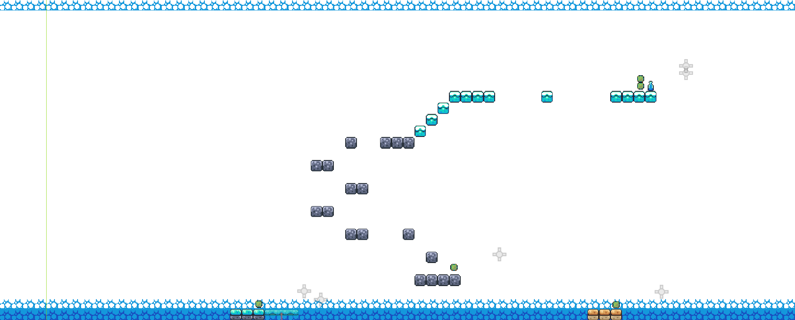

# 🛡️ Knight Platformer Game (Godot)

This is my **first game project using the Godot Engine** — a fun and simple 2D platformer where you control a knight to jump over obstacles, avoid enemies, and explore the level.

## 🎮 Game Features

- 2D side-scrolling platformer.
- Play as a pixel-art knight character.
- Platforming challenges, enemies, and obstacles.
- Built using **Godot** and **GDScript**.

## 🎓 Learning Purpose

This is a **practice project** to get started with game development in Godot. Through this, I learned:
- How to use Godot scenes and nodes.
- Basics of physics and collision.
- Animations, tilemaps, and scripting in GDScript.

## 🖼️ Screenshots

### Level Design Preview

### Alternate View

## 🛠 Tools Used

- [Godot Engine](https://godotengine.org/)
- GDScript
- Free pixel-art asset packs

## 🚀 How to Run

1. Download or clone this project.
2. Open it in **Godot**.
3. Run the `Main.tscn` or `Level1.tscn` scene.

